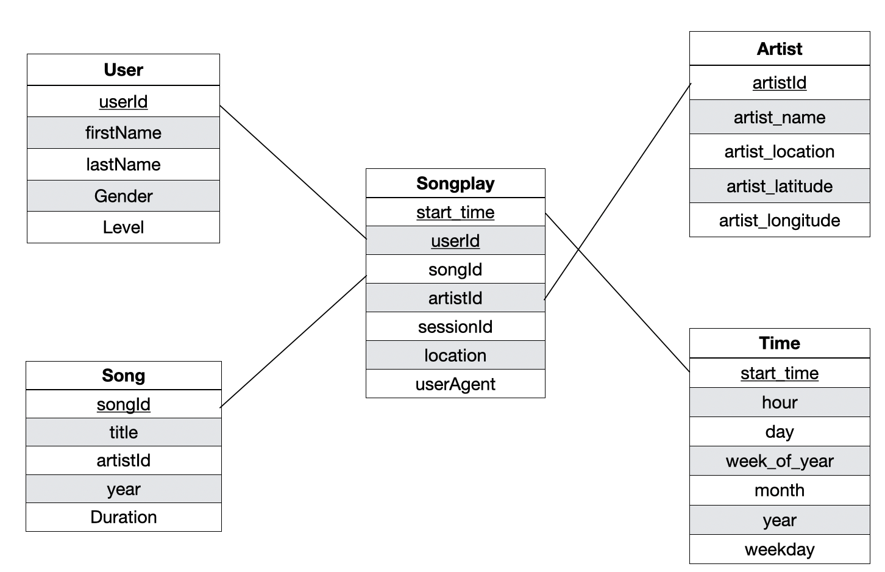

# Data Modeling with Postgres

## Introduction:
Sparkify is a startup who wants to analyze the data they've been collecting on songs and user activity on their new music streaming app. The analytics team is particularly interested in understanding what songs users are listening to. Currently, they don't have an easy way to query their data, which resides in a directory of JSON logs on user activity on the app, as well as a directory with JSON metadata on the songs in their app.

In this project, a database schema and a ETL pipeline are built using Postgres and Python. Fact and dimension tables for a star schema are explicitly defined as below.

## Instructions:
- Clone the repository
- Firstly, run the command: `python create_tables.py` to create the database as well as the tables
- Secondly, run the command: `python etl.py` to insert data. Alternatively, you can also use  `etl.ipynb` to insert data step by step.
- Finally, test the result by running the notebook: `test.ipynb`

 
## Required Python packages:
- psycopg2
- pandas
- datetime

One is assumed to have working Postgres environment on local laptop to run the codes.